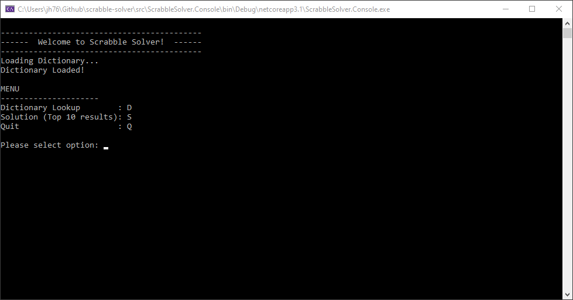
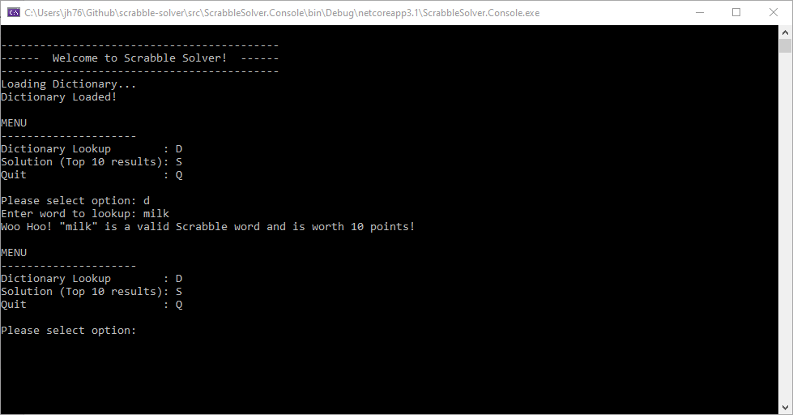
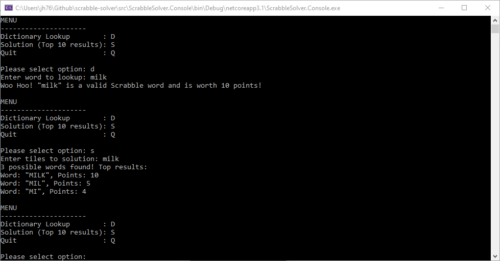

# scrabble-solver

1) Looks up valid Scrabble solutions from the SOPPODS Dictionary.
2) Offers valid solutions given a list of tiles (Scrabble Letters).

Search Algorithm uses the [Aho-Corasick](https://en.wikipedia.org/wiki/Aho%E2%80%93Corasick_algorithm) string searching algorithm.

